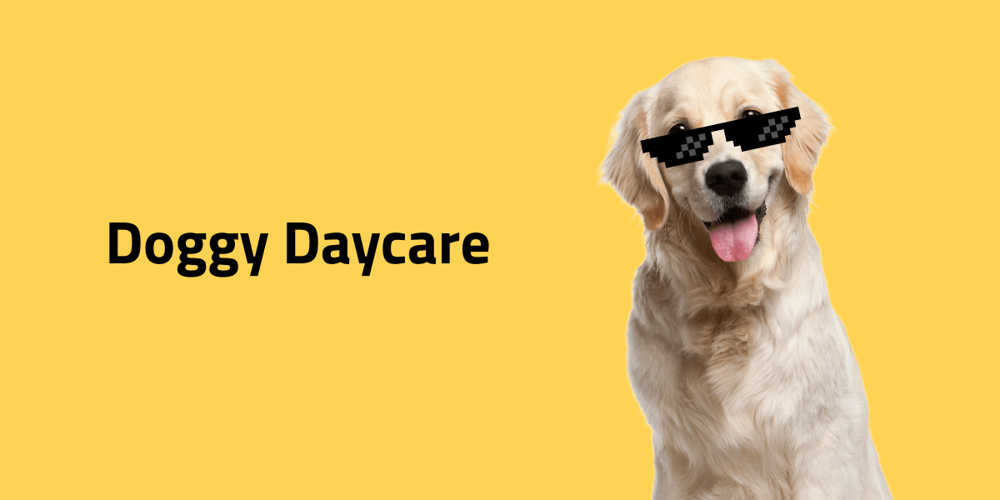

# Doggy Daycare

Du ska bygga en WebbApp för Doggy Daycare som hjälper dem hålla koll på hundar.

## Funktionalitet

* **Trevlig välkomstsida** där man hälsas välkommen
* **Register** där samtliga kunder som registrerats finns med ( dogs.json )
* VG: **Info** om varje hund som finns i registret layoutat och CSS:at vackert.

Figmalänk: https://www.figma.com/file/rGB9ihkhMsmUGP5uYaeSDq/Doggy-Daycare?node-id=0%3A1&t=7XWMXBX0EzQN3lHP-0

## API
Alternativ onlineurl to JSON data
```
https://majazocom.github.io/Data/dogs.json

https://doggydaycare.zocom.workers.dev/dogs
```
